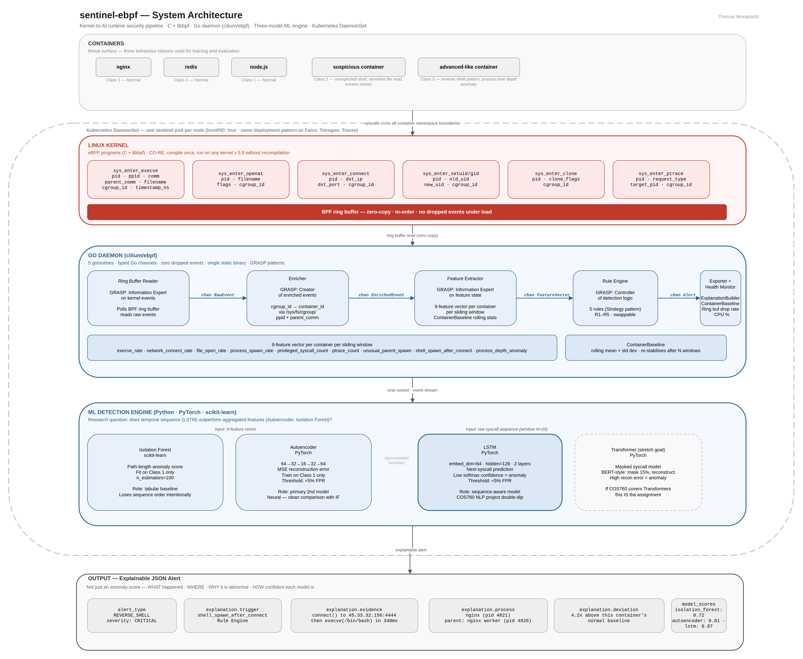
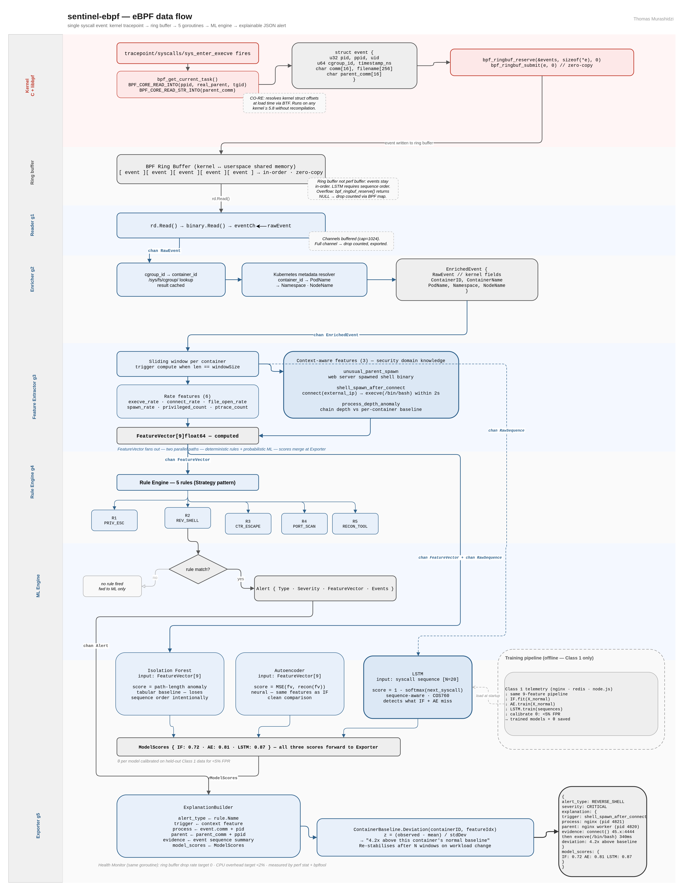
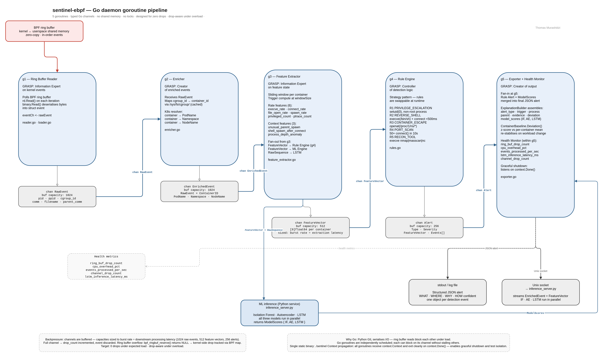

# sentinel-ebpf

> Kernel-to-AI runtime security for Kubernetes containers.  
> eBPF syscall telemetry · Go concurrent pipeline · three-model unsupervised ML · explainable alerts.

[](#secure-by-design-cicd)
[](LICENSE)
[](https://kernel.org)
[](https://go.dev)

--- >< ---

## What this is

**Sentinel-eBPF collects container syscall telemetry via six eBPF tracepoints including parent-child process lineage, processes events concurrently through a Go daemon with zero dropped events under expected load, extracts nine security-informed features including temporal process chain analysis, and compares three unsupervised anomaly detection approaches on both aggregated feature vectors and raw syscall sequences — demonstrating that behavioural deviation detection is resilient to threats that signature-based tools miss, with under 2% CPU overhead at idle.**

This is different from Falco or Tetragon in one specific way: every alert says **what** happened, **where** it happened, **why** it is abnormal relative to *this container's own baseline*, and how confident each of three independent ML models is. Not just an anomaly score.

> **Status:** Build 1 in progress — kernel tracer and Go daemon v1.  
> Demo videos, benchmark results, and SSRN pre-print will be linked here as each build phase completes.

--- >< ---

## Demo videos

| Video | What it shows | Status |
|---|---|---|
| Container escape detection | cgroup escape technique → eBPF tracer detects with full explainability output | Coming — Build 4 |
| Reverse shell detection | connect() then execve(/bin/bash) within 500ms → REVERSE\_SHELL alert | Coming — Build 4 |
| LSTM anomaly spike | 5 min normal baseline → malicious syscall injection → score spike above θ | Coming — Build 4 |

--- >< ---

## System architecture

<!-- Replace with exported PNG after opening docs/uml/src/diagram1_system_architecture.drawio -->


Four layers: Linux kernel instrumented via eBPF → Go daemon process>

### Secure-by-Design CI/CD
Due to the highly privileged nature of eBPF kernel instrumentation, this repository operates on a **Zero-Trust Local Pipeline** rather than relying on third-party cloud runners (e.g., GitHub Actions). To prevent CI supply chain attacks and ensure deterministic compilation of kernel objects, all static analysis, linting, and build verifications are cryptographically enforced via strict Git pre-commit hooks before code is permitted to enter the version control network.

--- >< ---

## eBPF data flow

<!-- Replace with exported PNG after opening docs/uml/src/diagram2_ebpf_data_flow.drawio -->


Single syscall event lifecycle: tracepoint fires → BPF ring buffer → five Go goroutines → ML inference → explainable JSON alert.

--- >< ---

## Go goroutine pipeline

<!-- Replace with exported PNG after opening docs/uml/src/diagram3_goroutine_pipeline.drawio -->


Five goroutines connected by typed Go channels. No shared memory, no locks. Fan-out at Feature Extractor (FeatureVector → Rule Engine and ML Engine in parallel). Fan-in at Exporter (Alert + ModelScores → final JSON).

--- >< ---

## How it works

### Layer 1 — Linux kernel (C + libbpf, CO-RE)

Six eBPF tracepoints capture the full attack surface across all container namespace boundaries. CO-RE (Compile Once, Run Everywhere) means the same `.bpf.o` object runs on any kernel ≥ 5.8 without recompilation.

| Tracepoint | Fields captured | Attacks detected |
|---|---|---|
| `sys_enter_execve` | pid, ppid, comm, parent\_comm, filename, cgroup\_id | Reverse shells, recon tools, LotL binaries, web shell execution |
| `sys_enter_openat` | pid, filename, flags, cgroup\_id | Container escape via `/proc/1/ns/*`, credential theft |
| `sys_enter_connect` | pid, dst\_ip, dst\_port, cgroup\_id | C2 callbacks, port scans, lateral movement |
| `sys_enter_setuid/gid` | pid, old\_uid, new\_uid, cgroup\_id | Privilege escalation: setuid(0) from non-root process |
| `sys_enter_clone` | pid, clone\_flags, cgroup\_id | Namespace escape, container isolation breakout |
| `sys_enter_ptrace` | pid, request\_type, target\_pid, cgroup\_id | Debugger-based process injection, memory inspection |

The `ppid` and `parent_comm` fields are captured from the kernel `task_struct` using `BPF_CORE_READ_INTO` — this powers the three context-aware features that distinguish sentinel-eBPF from a tutorial project.

### Layer 2 — Go daemon (cilium/ebpf)

Five goroutines communicate via typed Go channels. No shared memory, no locks. Python's GIL drops events under load; Go goroutines process ring buffer reads concurrently without drops.

| Goroutine | GRASP pattern | Responsibility |
|---|---|---|
| Ring Buffer Reader | Information Expert on kernel events | `rd.Read()` → deserialise → `eventCh <- rawEvent` |
| Enricher | Creator of enriched events | `cgroup_id → container_id` via `/sys/fs/cgroup/` · K8s: PodName, Namespace, NodeName |
| Feature Extractor | Information Expert on feature state | Sliding window · 9-feature vector · ContainerBaseline rolling stats |
| Rule Engine | Controller of detection logic | 5 deterministic rules (Strategy pattern, swappable) |
| Exporter + Health Monitor | Creator of output | ExplanationBuilder · JSON alerts · CPU% · drop rate · events/sec |

All goroutines receive a `context.Context` and exit cleanly on `context.Done()`.

### Nine-feature vector

The feature extractor computes a `[9]float64` vector per container per sliding window. The first six are rate-based. The last three encode security domain knowledge — this is the separation that makes the ML comparison meaningful.

**Rate features:**
- `execve_rate` — process execution frequency per window
- `network_connect_rate` — outbound connections per second
- `file_open_rate` — file system access frequency
- `process_spawn_rate` — `clone()` call frequency
- `privileged_syscall_count` — `setuid`/`setgid` events in window
- `ptrace_count` — process inspection events

**Context-aware features (security domain knowledge, not statistics):**
- `unusual_parent_spawn` — web server process (nginx, node, python) spawning a shell binary. Encodes: *web servers do not spawn shells.*
- `shell_spawn_after_connect` — `connect(external_ip)` followed by `execve(/bin/bash)` within 2 seconds. Encodes: *this is the reverse shell sequence.*
- `process_depth_anomaly` — max process chain depth vs per-container baseline. `nginx → bash → curl → sh` = depth 4, flagged if 2× above baseline.

### Layer 3 — Detection engine

Research question: **does temporal sequence information (LSTM) outperform aggregated feature representations (Autoencoder, Isolation Forest) for container anomaly detection?**

| Model | Input | Method | Role |
|---|---|---|---|
| Isolation Forest | `FeatureVector[9]` | Path-length anomaly scoring | Tabular baseline — intentionally loses sequence order |
| Autoencoder | `FeatureVector[9]` | MSE reconstruction error | Neural baseline — same features as IF, clean comparison |
| LSTM | Raw syscall sequence (N=20) | Next-syscall prediction, low softmax confidence = anomaly | Sequence-aware model — COS760 NLP double-dip |

All three models train on Class 1 (normal) data only. Thresholds calibrated for <5% false positive rate on held-out normal data.

### Explainable alert output

Every alert includes what happened, where it happened, and why it is abnormal — not just an anomaly score.

```json
{
  "alert_type": "REVERSE_SHELL",
  "severity": "CRITICAL",
  "container_id": "abc123",
  "explanation": {
    "trigger": "shell_spawn_after_connect",
    "process": "nginx (pid 4821)",
    "parent": "nginx worker (pid 4820)",
    "evidence": "connect() to 45.33.32.156:4444 then execve(/bin/bash) within 340ms",
    "deviation": "4.2x above this container's normal baseline"
  },
  "model_scores": {
    "isolation_forest": 0.72,
    "autoencoder": 0.81,
    "lstm": 0.87
  }
}
```

--- >< ---

## Evaluation design

### Three-class behaviour taxonomy

Models train on Class 1 only. Classes 2 and 3 are evaluation-only.

| Class | Description | Examples |
|---|---|---|
| Class 1 — Normal | Legitimate workloads executing designed functions | nginx serving HTTP, redis GET/SET, node.js API requests |
| Class 2 — Suspicious | Actions individually plausible but contextually abnormal | nginx spawning `/bin/bash`, DB container making outbound port 443, 10× baseline process creation |
| Class 3 — Advanced-like | Patterns associated with sophisticated attacks (no exploit code) | Reverse shell pattern, in-memory execution pattern, deep process tree chain |

### Detection metrics

Precision, Recall, F1, AUC-ROC — reported per model per behaviour class.

### Performance targets

| Metric | Tool | Target |
|---|---|---|
| CPU overhead | `perf stat` | < 2% at idle |
| Memory (Go daemon RSS) | `ps` | < 50MB |
| Ring buffer drop rate | Health Monitor goroutine | 0 drops |
| Syscall latency added | `bpftrace` timing | < 5 µs |
| LSTM inference latency | Event arrival to alert | < 100ms |

Benchmarks run on UP IT lab machines. Laptop numbers are not valid research data.

### Evasion awareness

| Evasion technique | Effect | Mitigation |
|---|---|---|
| High-volume syscall noise | Dilutes rate-based anomaly scores | Context features are event-triggered, not rate-based — resistant to volume dilution |
| Syscall rate throttling | Paced activity stays below rate thresholds | LSTM detects because pacing does not change the sequence — `execve(/bin/bash)` after `connect()` is anomalous regardless of timing |
| Rare event masking | Low-frequency attacks fall below statistical significance | LSTM anomaly score is confidence-based, not frequency-based — unseen sequence scores near-zero regardless of frequency |
| Concept drift | Evolving workloads generate false positives | `ContainerBaseline` uses a rolling window — re-stabilises after N windows |
| eBPF program tampering | Container with `CAP_SYS_ADMIN` can interfere with ring buffer | DaemonSet enforces `allowPrivilegeEscalation: false`, `capabilities: drop: ALL` |

--- >< ---

## Repository structure

```
sentinel-ebpf/
├── README.md
├── LICENSE                          ← Apache 2.0
├── Makefile                         ← Local Zero-Trust build pipeline
├── kernel/
│   ├── tracer.bpf.c                 ← eBPF kernel programs (C + libbpf, CO-RE)
│   └── headers.h                    ← Shared event structs (pid, ppid, parent_comm)
├── daemon/
│   ├── main.go                      ← Goroutine orchestration + context propagation
│   ├── loader.go                    ← cilium/ebpf BPF loading
│   ├── enricher.go                  ← cgroup_id → container_id + K8s metadata
│   ├── feature_extractor.go         ← 9-feature vectors including context-aware features
│   ├── rules.go                     ← Rule-based detection engine (Strategy pattern)
│   ├── exporter.go                  ← JSON alerts with ExplanationBuilder + ContainerBaseline
│   └── go.mod
├── ml/
│   ├── isolation_forest.py
│   ├── autoencoder.py
│   ├── lstm_model.py
│   ├── inference_server.py          ← Unix socket server, all three models
│   └── notebooks/                   ← Evaluation notebooks per behaviour class
├── evaluation/
│   ├── datasets/normal/             ← Class 1 telemetry (nginx, redis, node.js)
│   ├── datasets/suspicious/         ← Class 2 telemetry
│   ├── datasets/advanced/           ← Class 3 telemetry
│   ├── labels.csv
│   ├── metrics.py                   ← Precision, Recall, F1, AUC-ROC per model per class
│   └── benchmark.py                 ← CPU, memory, latency
├── docs/
│   ├── diagrams/                    ← PNG exports for README
│   └── diagrams/src/                ← draw.io source files (.drawio)
├── deploy/
│   ├── daemonset.yaml               ← Kubernetes DaemonSet (hostPID: true)
│   └── docker-compose.yml
├── scripts/bpftrace/                ← Build 0 exploration scripts
└── paper/preprint.md                ← SSRN DOI link (September 2026)
```

--- >< ---

## Quick start

> Build 1 is in progress. These instructions will be complete and tested by end of April 2026.

**Prerequisites:** Linux kernel ≥ 5.8, Go 1.21+, clang/LLVM, Docker.

```bash
git clone https://github.com/Murashidzi/sentinel-ebpf.git
cd sentinel-ebpf

# Build the eBPF kernel program
make -C kernel

# Build and run the Go daemon
cd daemon
go build -o sentinel .
sudo ./sentinel

# In a second terminal — run the ML inference server
cd ml
pip install -r requirements.txt
python inference_server.py
```

The daemon writes structured JSON alerts to stdout. Pipe to `jq` for readable output:

```bash
sudo ./sentinel | jq .
```

--- >< ---

## Technology stack

| Layer | Technology |
|---|---|
| Kernel instrumentation | C, libbpf, CO-RE, clang/LLVM |
| User-space daemon | Go 1.21+, cilium/ebpf |
| Feature extraction | Go (feature\_extractor.go) |
| ML engine | Python, PyTorch (Autoencoder, LSTM), scikit-learn (Isolation Forest) |
| Container environment | Docker, minikube, Kubernetes |
| Benchmarking | perf stat, bpftool, bpftrace |
| CI/CD | Strict Git pre-commit hooks + Makefile |
| Deployment | Kubernetes DaemonSet |

--- >< ---

## Build status

| Phase | Description | Status |
|---|---|---|
| Build 0 | bpftrace exploration + Go prerequisite gate | Complete |
| Build 1 | C eBPF tracer (execve) + Go daemon v1 | In progress |
| Build 2 | All 6 tracepoints + feature extractor + rule engine | Planned — May |
| Build 3 | Three-model ML engine + explainability layer | Planned — June |
| Build 4 | Performance benchmarks + Kubernetes DaemonSet + Loom videos | Planned — July |
| Build 5 | Open source contributions (Tetragon/Tracee/Falco PRs) | Parallel — June–Aug |

--- >< ---

## Research context

**Title:** Evaluation of Unsupervised Anomaly Detection on eBPF-Based Container Syscall Telemetry  
**Supervisor:** Mr. SM Makura, University of Pretoria  
**Module:** COS700 Honours Research Project in Computer Science, 2026  
**Pre-print:** SSRN link coming September 2026

**Research question:** Can unsupervised machine learning models detect anomalous container behaviour using syscall telemetry collected via eBPF, and which behavioural representation provides the most effective detection performance?

**Hypothesis:** Kernel-level syscall telemetry provides sufficiently rich behavioural signals to enable unsupervised anomaly detection models to identify deviations from normal container execution with acceptable accuracy and minimal overhead.

--- >< ---

## Related work in this repository

This project is the fourth in a progression:

| Repository | What it proves |
|---|---|
| [Zero Trust Banking Platform](https://github.com/Murashidzi) | Production cloud infrastructure: OIDC, EKS, SecurityContext, ECR scanning, Terraform IaC — the environment this tool protects |
| [WISP Network Lab](https://github.com/Murashidzi) | Network infrastructure depth: VRRP, CGNAT, PPPoE, RADIUS, VLAN, Telegraf/InfluxDB/Grafana |
| [SecureSME (v0)](https://github.com/Murashidzi) | eBPF concept validation: hooked sys\_execve, captured kernel events, validated against reverse shells. Documented limits that sentinel-eBPF fixes. |
| **sentinel-ebpf (this repo)** | The synthesis: C kernel programs, Go concurrent daemon, three-model ML, Kubernetes DaemonSet, production benchmarks |

--- >< ---

## License

Apache 2.0 — see [LICENSE](LICENSE).
